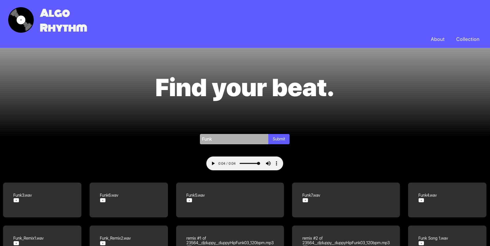

# Algo-Rhythm
=============

## Summary

Algo-Rhythm is a personal music app to explore new beats and rhythm to download for mixing music. In this project, I used the FreeSound API to collect sound data for over 10,000 public uploads with Vuejs and Nuxtjs, which was very new to me and the first project using the frameworks. Initially, the purpose of this app was to find a song or music that best fit my mood and state of mind on the day. However, the music on Spotify was mainly trendy and mainstream, which is fine, but I thought it would be fun to find beats through the BPM and tempo to create my own mix and creating my own algorithm.

Algo-Rhythm is the final project of our Software Engineering Immersive course at General Assembly Sydney, and by far my favourite project I've worked on during the course.

## Key functionalities

Type in any sound keyword (Rock, Bass, Piano, Techno, Cow, Horse etc.), and the list of results collected from FreeSound will appear. Once clicking on a sound card, the audio preview appears, and the '+' buttons will allow you to add sounds to your collection.

NOTE: Remove function has not been created yet on the collection list. This is to be handled with next.

## Tech Stack

* Vue.js
* Nuxt.js
* Javascript
* CSS / Vuesax

## Design Layout

Straightforward design yet organised design layout. I went for simplicity this time as I wanted to learn more of the logics in vuejs. Moving forward, the design will continuously improve with more features such as better buttons, audio styling, and hopefully, a little bit animations to keep the site fun and alive - i.e. audio waves

**Search view**



**Sound Collection view**


## Functionality and Features

* Landing page - Heading, subheading, navigation bar
* Search page - Search input, search button to gather data,
* Result list displayed once the sound data is collected. Clicking the sound cards will let the audio player appear for preview before adding the sound to your collections.
* Audio player lets you download the sound directly into your computer. Press the three-dotted dropdown button on the audio player.
* Collection page - List of added sounds display, and ready for preview and downloading. You can play the sounds at the same time, or individually.
* Click on the Algo-Rhythm logo to go back to the landing page.

## Future Improvements

This has become an ambitious project where I would love to carry on with. Adding features like visual sound waves using bpm/tempo, more than one collection list, uploading my own mix, and of course the user-experience and user-interface needing improvements.

## Live Site

Algo-Rhythm: https://algo-rhythm.surge.sh

## Build Setup

```bash
# install dependencies
$ npm install

# serve with hot reload at localhost:3000
$ npm run dev

# build for production and launch server
$ npm run build
$ npm run start

# generate static project
$ npm run generate
```

For detailed explanation on how things work, check out [Nuxt.js docs](https://nuxtjs.org).
